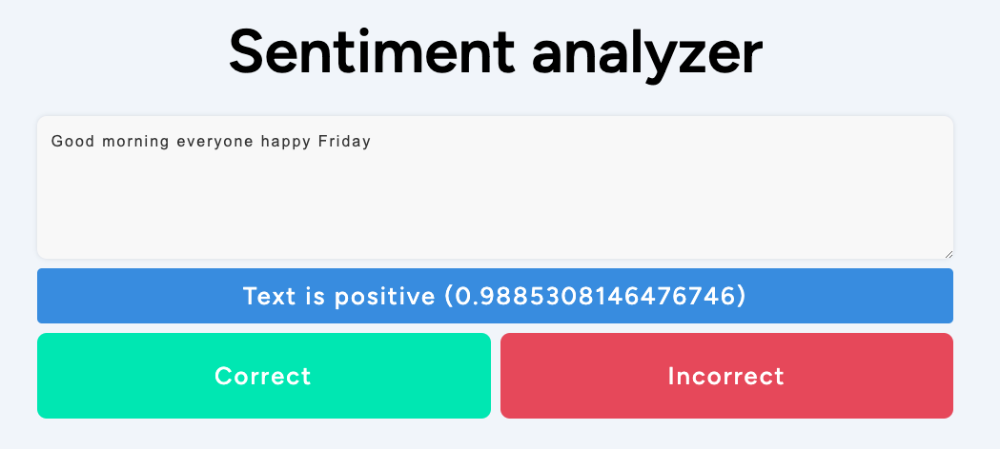

# Sentiment.parf.ai

## Introduction

This project analyze sentiment of a text and predict between 0 to 1 if a text is wether positive or negative.

You can read [this blog post](https://blog.parf.ai/posts/sentiment/) to know more about it.

- **PROD**: https://sentiment.parf.ai/
- **DEV**: https://dev.sentiment.parf.ai/

## Structure

- **.github**: Automated deployments
- **api**: All the code used for the API
- **infrastructure**: The terraform infrastructure (everything is automated)
- **website**: All the code related to the website